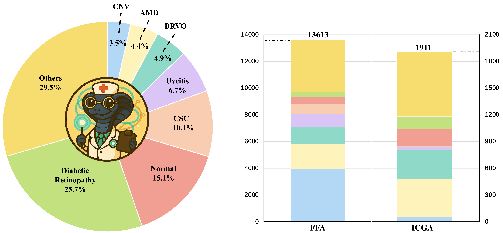
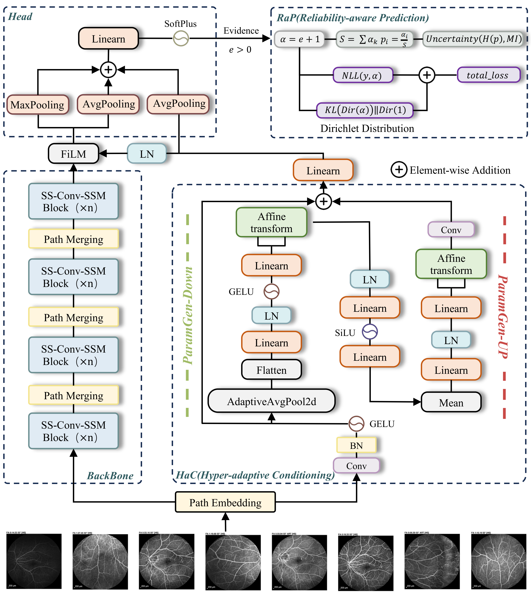

<h1 align = "center">

<em>CLEAR-Mamba</em> : Towards Accurate, Adaptive and Trustworthy Multi-Sequence Ophthalmic Angiography Classification
</h1>

<div align="center">
Zhuonan Wang<sup>1</sup>, Wenjie Yan<sup>1</sup>, Wenqiao Zhang<sup>1</sup>, 

Xiaohui Song<sup>1,2</sup>, Jian Ma<sup>1,2</sup>, Ke Yao<sup>1,2</sup>, Yibo Yu<sup>1,2</sup>, Beng Chin Ooi<sup>1</sup>,

<sup>1</sup>Zhejiang University,
<sup>2</sup>Eye Center of the Second Affiliated Hospital,

<br><br>

<a href='https://arxiv.org/abs/2601.20601'></a> 
</div>


## 🌟 Overview
Welcome to **CLEAR-Mamba**! 🚀

**CLEAR-Mamba** is an enhanced medical image classification framework for ophthalmic angiography analysis, designed to improve both cross-domain generalization and prediction reliability. Built upon MedMamba, this project introduces a **hypernetwork-based adaptive conditioning module (HaC)** and a **reliability-aware prediction scheme (RaP)** based on evidential uncertainty learning, enabling the model to better adapt to diverse imaging distributions while producing more trustworthy predictions for retinal disease classification across FFA and ICGA modalities.

# 🔥 News
- **[2026.03.11]** 🎉🎉🎉 Our paper is now available.
- **[2026.03.11]** We have released the core training scripts for this project.

### TODO
- [x] Release the paper.
- [x] Release the core training scripts.
- [ ] Release complete inference scripts for different datasets.
- [ ] Release the dataset.
- [ ] Construct the project website.
  
### 📚 Dataset and Task
**CLEAR-Mamba** is designed for **single-modality, multi-sequence ophthalmic angiography classification**, aiming to improve both **cross-domain adaptability** and **prediction reliability** in real-world clinical settings.  
It supports retinal disease classification on **FFA** and **ICGA** images, and is evaluated on a large-scale in-house ophthalmic angiography dataset covering **43 disease categories**, as well as three public benchmarks: **RetinaMNIST**, **OCT-C8**, and **Harvard-GDP**.

<p align="center">
  
</p>

### 🏗️ Architecture
The **CLEAR-Mamba** framework is built upon **MedMamba** for efficient spatio-temporal modeling of ophthalmic angiography images.  
It introduces **HaC (Hyper-adaptive Conditioning)** to perform sample-specific feature modulation for better domain adaptability, and **RaP (Reliability-aware Prediction)** based on evidential learning to provide calibrated predictions with uncertainty estimation, enabling more trustworthy disease classification.

<p align="center">
  
</p>

## 🛠️ Getting Started
The environment setup of this repository mainly follows **MedMamba**.  
Please refer to the original **MedMamba** implementation for dependency installation and basic environment configuration.

After completing the MedMamba setup, you can further install the additional requirements of this project and run the released training scripts for **CLEAR-Mamba**.


### ⚙️ Training Configuration
The main training settings of **CLEAR-Mamba** are controlled in `MD_train.sh`.

- `--hyper-ad`: controls whether the **hypernetwork-based adaptive conditioning module (HaC)** is enabled.  
  - `0`: disabled  
  - `1`: enabled  

- `--EDL`: controls whether the **evidential learning for reliability-aware prediction（RaP）** is enabled.  
  - `0`: disabled  
  - `1`: enabled  

When **HaC** is enabled, its key hyperparameters include:

- `--reduction-ratio`: controls the bottleneck reduction ratio in the hypernetwork.  
  Typical choices: `1`, `2`, `4`, `8`

- `--had-feat-dim`: controls the hidden feature dimension of the hypernetwork.  
  Typical choices: `32`, `64`, `96`, `128`

For **RaP**, the KL regularization coefficient is controlled by:

- `--kl-coef`: the coefficient of the KL regularization term in evidential learning.  
  The default setting is `5e-3`.

Optional adaptive variants include:
- `adaptive(1e-2)`
- `adaptive(1e-3)`
- `adaptive(1e-4)`
- `adaptive(5e-3)`
- `adaptive(5e-4)`

### Example Training Commands
```bash
CUDA_VISIBLE_DEVICES=0 python MD_train.py --batch-size 128 --epochs 150 \
--hyper-ad 1 --reduction-ratio 2 --had-feat-dim 32 \
--EDL 1 --kl-coef 5e-3 \
--save-name main 2>&1 | tee ./logs/mamba/main.log
```

### Release Status
The current release includes representative training commands.  Additional training scripts and inference scripts for different experimental settings will be provided in future updates.

## 🔗 Citation
If you find this work useful, please consider giving this repository a star and citing our paper:

```bibtex
@article{wang2026clear,
  title={CLEAR-Mamba: Towards Accurate, Adaptive and Trustworthy Multi-Sequence Ophthalmic Angiography Classification},
  author={Wang, Zhuonan and Yan, Wenjie and Zhang, Wenqiao and Song, Xiaohui and Ma, Jian and Yao, Ke and Yu, Yibo and Ooi, Beng Chin},
  journal={arXiv preprint arXiv:2601.20601},
  year={2026}
}
```


## 🤝 Acknowledgment
This project is developed based on [MedMamba](https://github.com/YubiaoYue/MedMamba). We sincerely thank the authors for their excellent work and open-source contribution.

## ⚖️ License
This repository is under [Apache License 2.0](LICENSE).